<p align="center">
  
</p>

<p align="center">
  
  
  
  
  
</p>

This tool was built for HERO Software (https://hero-software.de) and enables craftsmen to record measurements on the job site hands-free using voice input.

Instead of writing measurements down manually, the user can speak rooms, dimensions, and flooring context into the app and continue working while the system structures the result in the background.

##  What It Does

The browser client captures spoken input with `MediaRecorder`, uploads the audio as `multipart/form-data`, and waits for a typed `rooms` response from the backend. FastAPI hands the audio to ElevenLabs for speech-to-text, passes the transcript plus the material catalog into OpenAI `gpt-5.4`, and receives validated room objects back as `MeasurementResult`. Those rooms are inserted into a responsive React table where users can review, correct, extend, and export the measurements. In parallel, the backend turns every recognized material except `UNBEKANNT` into HERO GraphQL document actions using the computed room area as quantity.

##  Features

-  One-button microphone workflow with pipeline states `idle`, `recording`, `processing`, `done`, and `error`
-  Live frontend-to-backend upload to `POST /process_audio`
-  Real ElevenLabs speech-to-text integration at `https://api.elevenlabs.io/v1/speech-to-text`
-  Real OpenAI structured extraction via `client.responses.parse(...)` with model `gpt-5.4`
-  Typed room extraction with `name`, `length_m`, `width_m`, `material_id`, and optional `comment`
-  Automatic area calculation per row plus a running total in square meters
-  Manual row creation plus inline editing and deletion
-  Responsive table/card UI for mobile and desktop layouts
-  Warning and success toast notifications
-  Print/PDF export with totals, comments, and signature lines
-  HERO GraphQL document creation for recognized materials

##  Tech Stack

### Frontend

| Package                | Version   | Type          |
| ---------------------- | --------- | ------------- |
| `react`                | `18.2.0`  | dependency    |
| `react-dom`            | `18.2.0`  | dependency    |
| `@vitejs/plugin-react` | `4.2.1`   | devDependency |
| `autoprefixer`         | `10.4.19` | devDependency |
| `postcss`              | `8.4.38`  | devDependency |
| `tailwindcss`          | `3.4.3`   | devDependency |
| `vite`                 | `5.2.10`  | devDependency |

### Backend

| Package             | Declared in `pyproject.toml` | Locked in `uv.lock`   |
| ------------------- | ---------------------------- | --------------------- |
| `fastapi[standard]` | `>=0.135.3`                  | `fastapi 0.135.3`     |
| `httpx`             | `>=0.28.0`                   | `httpx 0.28.1`        |
| `openai`            | `>=1.70.0`                   | `openai 2.31.0`       |
| `python-dotenv`     | `>=1.1.0`                    | `python-dotenv 1.2.2` |

### Runtime / Tooling

-  Python `>=3.13` · version file: `3.13` · mise: `3.13.5`
-  Node `22.14.0` via `mise.toml`

##  Voice Pipeline

### 1. Audio capture in the browser

-  `MicButton.jsx` requests mic access via `navigator.mediaDevices.getUserMedia({ audio: true })`
-  Records with `MediaRecorder` — preferred: `audio/webm;codecs=opus`, fallback: `audio/mp4`

### 2. Frontend request to the backend

The frontend creates `FormData`, appends the blob as `file`, names it `recording.webm`, and sends it here:

```http
POST /process_audio
Content-Type: multipart/form-data
```

### 3. ElevenLabs integration

This integration is real, not mocked.

-  Endpoint: `https://api.elevenlabs.io/v1/speech-to-text`
-  Headers: `xi-api-key: $ELEVENLABS_API_KEY`
-  Fields: `file` (audio bytes) + `model_id: scribe_v1`

### 4. OpenAI integration

This integration is also real, not mocked.

-  SDK call: `AsyncOpenAI(...).responses.parse(...)`
-  Model: `gpt-5.4`
-  Input: `MATERIALS` list + ElevenLabs transcript
-  Structured target: `MeasurementResult`

```text
Extract room measurements from the German transcript. For each room, extract the name,
length and width in meters, and match the flooring material to the provided materials
list by ID. Include any additional comments mentioned for the room.
```

```json
{
  "rooms": [
    {
      "name": "string",
      "length_m": "Decimal",
      "width_m": "Decimal",
      "material_id": "HA0ZWAOXoAA | HA0bFSoDsAA | HA0Z0--YIAA | UNBEKANNT",
      "comment": "string | null"
    }
  ]
}
```

### 5. HERO document creation

-  Endpoint: `https://login.hero-software.de/api/external/v9/graphql`
-  Auth: `Authorization: Bearer $HERO_API_TOKEN`
-  One action per room where `material_id != UNBEKANNT`

##  Frontend ↔ Backend

-  Dev proxy: `/process_audio → http://localhost:8000`
-  Payload: `FormData` with one field `file`
-  On success: filters via `isValidRow(...)`, appends to React state, shows success toast
-  On error: warning toast + pipeline state switches to `error`

##  Getting Started

### Backend

```bash
cd backend
cp .env.example .env
uv sync
uv run python -m uvicorn main:app --reload --port 8000
```

### Frontend

```bash
cd frontend
npm install
npm run dev
```

##  API Endpoints

| Method | Path             | Request body                   | Response                 | Description                                                              |
| ------ | ---------------- | ------------------------------ | ------------------------ | ------------------------------------------------------------------------ |
| `POST` | `/process_audio` | `multipart/form-data` (`file`) | `MeasurementResult` JSON | Transcribes audio, extracts rooms, creates HERO actions, returns results |

- `422 Unprocessable Entity` — `"Could not extract measurements from audio"` if extraction returns `None`

##  Environment Variables

| Variable             | Where referenced         | Purpose                                             |
| -------------------- | ------------------------ | --------------------------------------------------- |
| `OPENAI_API_KEY`     | `backend/services.py`    | Authenticates the OpenAI `AsyncOpenAI` client       |
| `ELEVENLABS_API_KEY` | `backend/services.py`    | Authenticates the ElevenLabs speech-to-text request |
| `HERO_API_TOKEN`     | `backend/hero_client.py` | Authenticates the HERO GraphQL request              |

##  Project Structure

```text
.
├─ banner.svg
├─ mise.toml
├─ backend/
│  ├─ .env.example
│  ├─ hero_client.py
│  ├─ main.py
│  ├─ models.py
│  ├─ pyproject.toml
│  ├─ services.py
│  └─ uv.lock
└─ frontend/
   ├─ package.json
   ├─ tailwind.config.js
   ├─ vite.config.js
   └─ src/
      ├─ App.jsx
      ├─ index.css
      └─ components/
         ├─ AufmassTable.jsx
         ├─ MicButton.jsx
         └─ Toast.jsx
```

##  About HERO Software

HERO Software is Germany's leading craft management platform, used by thousands of tradespeople for invoicing, project management, and field operations. This project extends HERO's ecosystem with a voice-driven measurement workflow deeply integrated into HERO's GraphQL API. Learn more at https://hero-software.de.

##  CheftreffAI Hackathon

Built at the CheftreffAI Hackathon as a rapid prototype exploring AI voice interfaces for the trades industry.

##  License

MIT © 2025 HERO Software GmbH
